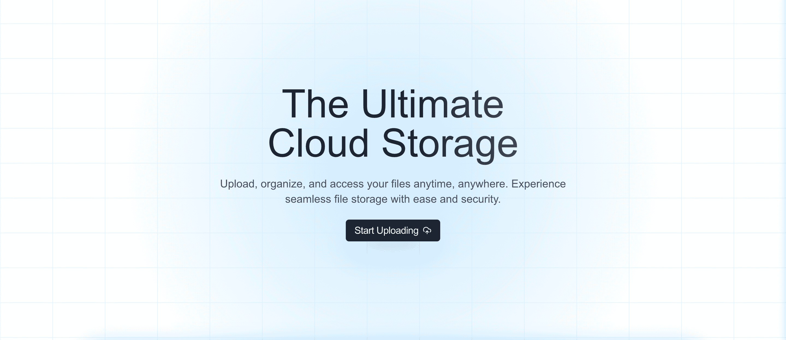

# Simple Storage

<!--  -->

## Description

**Simple Storage** is a Cloud Storage platform powered by AWS S3, designed to provide an easy and efficient way to upload, store, and retrieve files. With features such as file uploads, sorting, and faster retrieval using CloudFront CDN, it aims to offer a seamless experience for users needing a reliable cloud storage solution.

## Features

- **Upload Files**: Securely upload files to the cloud.
- **Sort Files**: Organize files based on various criteria.
- **CloudFront CDN**: Faster file retrieval through CloudFront CDN, providing low-latency access to your files.

## Techologies Used

- **Next.js**: A powerful React framework for building scalable and fast web applications.
- **AWS S3**: Cloud storage service used for storing the uploaded files.
- **AWS CloudFront**: Content Delivery Network (CDN) for fast file retrieval.
- **ShadCN UI**: A modern UI library for styling the components.
- **TypeScript**: A statically typed superset of JavaScript used to improve development efficiency and reliability.
